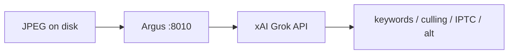

# Argus vision standard — Grok API only

> **As of 2026-06-23:** All Argus image understanding uses the **xAI Grok API**.
> Local Ollama / qwen3-vl is **retired** for Argus vision tasks.

## Architecture



| Mode | Backend | When |
|------|---------|------|
| CI / pytest | `mock` | Always — no API calls |
| Production / dogfood | `grok` | `XAI_API_KEY` + `ARGUS_VISION_BACKEND=grok` |

`ARGUS_VISION_BACKEND=real` is an alias for `grok` (backwards compat).

## Env

```bash
# .env (never commit)
XAI_API_KEY=xai-...
ARGUS_VISION_BACKEND=grok
ARGUS_VISION_MODEL=grok-2-vision-1212   # or grok-4-* vision-capable model
```

## Dogfood

```bash
cd ~/ai-workspace/argus
ARGUS_VISION_BACKEND=grok \
  .venv/bin/python scripts/dogfood_real.py data/demo --limit 2 --client-id kevin
```

No Ollama load. Typical latency: seconds per image (API), not minutes.

## Test asset generation

Grok `GenerateImage` (via Cursor/Grok Build) can still create F&B test JPEGs when
real galleries aren't on disk. **Analysis** always goes through Argus → xAI API.

## References

- `app/grok_client.py`, `app/vision.py`
- `scripts/dogfood_real.py`
- ORACLE: [[entities/tools/argus]]