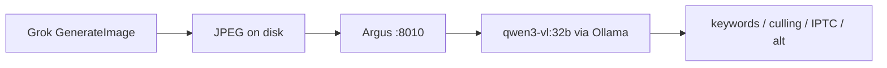

# Argus dogfood standard — Grok generates, Qwen analyzes

> Fleet convention for vision iteration when real client galleries are unavailable,
> scratch assets fail, or `{}` degenerate JSON blocks progress.

## The loop



| Step | Tool | Role |
|------|------|------|
| 1. Create | **Grok** `GenerateImage` | Photorealistic F&B test photos (hero plate, interior, cocktail, etc.) |
| 2. Analyze | **Qwen** `qwen3-vl:32b` on mickey | Argus real vision (`ARGUS_VISION_BACKEND=real`) — never Grok for analysis |

**Why not Grok for vision?** Argus is the fleet's shared vision layer. It must run the
same Ollama model path as production (mise, mnemosyne, Odysseus-adjacent workflows).
Grok image gen is only the **asset factory** for dev.

## When to use this standard

| Context | Use Grok→Qwen? |
|---------|----------------|
| Dev / prompt tuning / parser fixes | **Yes** — default unblock path |
| CI / pytest | **No** — `ARGUS_VISION_BACKEND=mock` only |
| Pre-deploy smoke on mickey | **Yes** — quick 3-image batch |
| Production quality gate | **No** — must dogfood **real edited galleries** before trusting Phase 0 bar |

Grok→Qwen proves the **pipeline works**. Real galleries prove the **outputs save Kevin time**.

## Procedure

### 1. Generate (Grok)

Prompt for editorial F&B photography — specific dish, lighting, composition. Save to:

```
~/ai-workspace/argus/data/dogfood-gallery-grok/
  01-hero-plate.jpg
  02-interior-wide.jpg
  03-cocktail-detail.jpg
```

Use landscape `3:2` for plates/interiors, portrait `2:3` for drink details.

### 2. Analyze (Qwen via Argus)

```bash
cd ~/ai-workspace/argus
ARGUS_VISION_BACKEND=real \
ARGUS_DATA_DIR=./data/dogfood-grok-run \
  .venv/bin/python scripts/dogfood_real.py \
  data/dogfood-gallery-grok --limit 3 --client-id kevin
```

### 3. Pass criteria

- 0% degenerate `{}` JSON (retry path in `vision.py` handles intermittent qwen3-vl quirks)
- Keywords specific (not "food on a plate")
- Keeper/hero scores directionally sensible
- Log run_id + elapsed_s in `docs/PHASE-5.md` or handoff

## Alternatives considered

| Approach | Verdict |
|----------|---------|
| Scratch solid-color JPEGs (Pillow) | Good for **mock/CI** only — too little signal for vision quality |
| Only real client galleries | Best for **prod gate** — slow, privacy/path friction for daily dev |
| Grok for both gen and analysis | **Rejected** — splits fleet vision across providers; mnemosyne/mise can't call Grok |
| qwen3-vl-abliterated | Fallback if base model over-censors F&B; default stays `qwen3-vl:32b` |

**Standard:** Grok gen → Qwen check for dev. Real gallery pass before calling Phase 5 done.

## References

- `scripts/dogfood_real.py`
- `docs/PHASE-5.md` — first Grok-gen batch (5/5 pass, 2026-06-23)
- ORACLE: [[entities/tools/argus]]