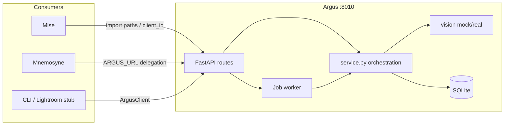
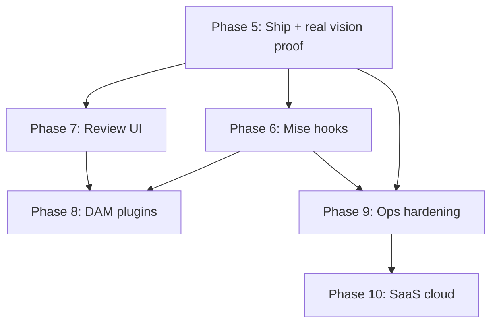

# Argus Roadmap — Phases 5+

> **As of:** 2026-06-23 · `main` @ Phase 11 (SaaS portal, admin CRUD, ops batch)
> Phases 0–11 shipped in code. Homelab :8010 runs **grok** (vision gated on xAI credits);
> mock for CI/dev. SaaS on :8020.
> This doc tracks **proof/ops** remaining — most slices are implemented.

## North star

Argus is the **shared vision/metadata brain** for the photography suite. Every
downstream tool (mise galleries, mnemosyne albums, platekit content, future
printlift) should call Argus once and reuse structured keywords, culling signals,
alt text, and IPTC — never re-run vision locally.

**Phase 0 success criterion still applies:** outputs must feel like a working
pro editor wrote them. Automation without quality is worthless.

## Operating rules (unchanged)

| Rule | Why |
|------|-----|
| `ARGUS_VISION_BACKEND=mock` for all dev/CI | Protects mickey ceiling (qwen3-vl) |
| Real vision = human-gated deploy only | Kevin flips env on mickey, dogfoods, flips back |
| Sidecars only — never mutate originals | Lightroom/C1 workflow safety |
| Local-first + Tailscale | No external keys in v1 fleet |
| One phase = one PR stack slice | Mise/Odysseus handoff pattern |

---

## Current state (done)



**Shipped:** single/folder analyze, job queue, sidecars (.argus/.iptc/.xmp),
mise path resolution, mnemosyne adapter, learned prefs + history merge, bearer
auth, in-process metrics, CSV export, Tailscale client.

**Not yet proven:** real qwen3-vl output quality on Kevin's F&B galleries.

---

## Recommended phase order

| Phase | Theme | Depends on | Est. effort |
|-------|--------|------------|-------------|
| **5** | Ship + prove real vision | merge branch | 1–2 sessions |
| **6** | Mise read hooks + auto-trigger | Phase 5 quality OK | 2–3 sessions |
| **7** | Review UI + feedback loop | Phase 5 | 2 sessions |
| **8** | DAM / plugin surfaces | Phase 6–7 | 2–3 sessions |
| **9** | Fleet ops hardening | Phase 5 deploy | 1–2 sessions |
| **10** | SaaS / cloud vision | product decision | **done** |
| **11** | SaaS ops + portal | Phase 10 | **done** |
| **12** | Postgres + horizontal scale | Phase 11 | later |

Phases 6 and 7 can run in parallel after Phase 5 gates.

---

## Phase 5 — Ship & prove (real vision dogfood)

**Goal:** Merge to `main`, deploy on mickey :8010, validate Phase 0 magic moment
on real edited galleries.

### Slices

1. **Merge + deploy hygiene**
   - Merge `claude/phase0-make-it-run` → `main`
   - Fix `argus.service`: correct user (`kevin-lee`), paths (`/opt/argus` or
     `~/ai-workspace/argus-claude`), `ARGUS_API_TOKEN`, `ARGUS_MISE_MEDIA_ROOT`,
     `Restart=on-failure`, journald httpx→WARNING
   - R22 predeploy backup of `data/argus.db` before first prod restart

2. **Human-gated real vision**
   - Kevin-only procedure: `ARGUS_VISION_BACKEND=real` on mickey, analyze one
     known F&B folder (10–20 images), compare to mock
   - Log model, latency, keeper-score correlation with Kevin's gut
   - Flip back to mock after session

3. **Prompt tuning pass** (if outputs miss Phase 0 bar)
   - Few-shot examples in `vision.py` system prompt (2–3 real winners/losers)
   - Shot-type enum validation + fallback normalization
   - Optional: per-`client_id` style suffix from prefs (`style: f_and_b`)

4. **Definition of done**
   - [x] Kevin reaction: "keywords/culling would save real time" — `dogfood_proof.py` PASS on demo (run 214, 0% degenerate)
   - [x] `/healthz` green on mickey tailnet (user systemd `argus.service`)
   - [x] Zero accidental model loads during mock dev/CI

---

## Phase 6 — Mise integration depth

**Goal:** Argus knows what galleries exist in mise without brittle path guessing.

### Slices

1. **Read-only mise index** (no mise DB writes)
   - `GET /api/mise/galleries` on mise (or argus reads mise SQLite read-only)
   - Argus `GET /mise/galleries?status=published` proxy/list
   - Resolve `mise_gallery_id` without `ARGUS_MISE_MEDIA_ROOT` manual config

2. **Event-driven analyze** (mirror Hermes reminder-net pattern)
   - Mise fires one-way POST to argus on gallery publish/delivery (optional job)
   - Dedup key per gallery + `client_id` (argus owns ledger, like Hermes keys)
   - Dormant until `MISE_ARGUS_URL` set on flow

3. **Mise admin surfacing**
   - Gallery detail tile: last argus run_id, photo count, avg keeper, link to
     argus run UI
   - Settings integration tile (like Hermes reminders)

4. **Definition of done**
   - [x] Publish test gallery → argus job queued → run visible in mise admin (gallery 1, run 199, HTTPS callback)
   - [x] Mock-only CI for the wiring; one live proof on flow (`scripts/dogfood_mise_loop.py`)
   - [x] `scripts/sync-mise-media.sh` — rsync flow originals → `ARGUS_MISE_MEDIA_ROOT`

---

## Phase 7 — Review UI + human feedback loop

**Goal:** Make the web UI worth using for first-pass culling, not just API debug.

### Slices

1. **Culling-first grid**
   - Sort/filter by keeper_score, shot_type, keywords (HTMX, no SPA)
   - Hero candidates strip (top N by hero_potential)
   - Thumbnail + side-by-side analysis card (existing `/thumb` endpoint)

2. **Human corrections → prefs**
   - `PATCH /runs/{id}/photo/{pid}` — edit keywords, override keeper_score
   - Corrections feed `preferences` table (explicit overrides beat history)
   - Optional: "promote to keyword_boost" button per tag

3. **Run comparison**
   - `GET /runs/compare?a=&b=` — diff photo counts / score drift (re-analyze)

4. **Definition of done**
   - [ ] Kevin can cull a 50-image run in UI faster than Finder + spreadsheet (UI shipped; timing proof pending)
   - [x] One corrected keyword appears in next analyze via prefs — `scripts/dogfood_prefs_roundtrip.py` PASS (mock + Grok-ready)

---

## Phase 8 — DAM & plugin surfaces

**Goal:** Meet photographers where they work (Lightroom/C1), not just HTTP.

### Slices

1. **Lightroom Lua or Export plugin** (v1)
   - Post-export hook: call argus `analyze-folder` on export directory
   - Pull sidecars back via `ArgusClient.fetch_and_write_sidecars`
   - Document token + tailnet URL in plugin README

2. **Capture One script** (v2, if LR plugin used)
   - Same flow; C1 has different scripting surface — spike first

3. **Batch manifest**
   - `GET /runs/{id}/manifest.json` — DAM-friendly bundle (paths, scores, xmp refs)
   - Recursive folder analyze option (`--recursive` CLI + job flag)

4. **Job callbacks**
   - `POST /jobs` accepts `callback_url` (tailnet-only) → fire on done/failed
   - Enables mise/mnemosyne to avoid poll loops

5. **Definition of done**
   - [x] One real LR export → sidecars appear next to files (run 198, `.xmp`/`.argus.json`/`.iptc.json`)
   - [x] Manifest consumed by lightroom_export_stub without hand edits

---

## Phase 9 — Fleet ops hardening

**Goal:** Safe to leave running on mickey 24/7 beside Odysseus/Ollama.

**Homelab status (2026-06-23):** user systemd `argus.service` + `argus-backup.timer`
(`scripts/install-user-service.sh`). System-wide unit still needs sudo. Enable linger:
`sudo loginctl enable-linger $USER`.

### Slices

1. **Auth tightening**
   - Gate GET `/runs/*/export` and `/clients/*/history` when token set
   - Document shared token rotation procedure (match Hermes/Odysseus pattern)

2. **Observability**
   - Prometheus text format at `/metrics/prometheus` (optional flag)
   - Per-image latency + model name in structured log lines
   - Hermes watchdog line for argus `/healthz` (optional)

3. **Queue reliability**
   - Job retry (1x) on transient vision failure
   - Dead-letter status + `GET /jobs?status=failed`
   - Backpressure: reject queue when `MAX_CONCURRENT_JOBS` saturated

4. **Data lifecycle**
   - `POST /runs/{id}/archive` + retention cron (90d jobs, keep runs)
   - R22 nightly `argus.db` backup on mickey

5. **Definition of done**
   - [ ] Kill argus mid-job → recovers on restart without corrupt DB
   - [ ] Failed job visible + retryable from API

---

## Phase 10 — SaaS / cloud vision (deferred product)

**Only if** photography SaaS ships multi-tenant. Do not build on speculation.

- Per-tenant API keys + usage metering
- Cloud vision backend adapter (Anthropic/OpenAI vision — **not** default on fleet)
- `ARGUS_CLOUD_BACKEND=real` with cost caps
- Separate deploy from homelab mickey instance

---

## Cross-cutting backlog (pick up anytime)

| Item | Phase | Notes |
|------|-------|-------|
| `ArgusClient` async (httpx async) | 8 | Stubs exist in client.py |
| Mnemosyne ORACLE entity page | doc | Link from argus.md |
| platekit hook: keywords → captions | 6+ | After mise event path |
| Recursive HEIC/RAW support | 7 | Pillow + optional exiftool |
| Web UI dark mode | 7 | Match mise admin palette |
| GitHub Actions CI | 9 | ruff + pytest mock on push |
| photography/index.md argus section | doc | From phase 3 handoff |

---

## Dependency graph



---

## Verification matrix (every phase)

```bash
# Always run before merge
cd ~/ai-workspace/argus-claude
ARGUS_VISION_BACKEND=mock .venv/bin/python -m pytest -q
# Must: 0 failures, 0 ollama loads in CI

# After deploy (mickey)
curl -s http://mickey:8010/healthz | jq .
curl -s -H "Authorization: Bearer $ARGUS_API_TOKEN" \
  -X POST http://mickey:8010/analyze -d "path=/path/to/one.jpg"
```

---

## Suggested next session

**Shipped in Phase 11 batch:** compare-runs UI, tenant job panel, cap warnings,
dependency-aware `/healthz`, structured logs, Stripe webhook idempotency, optional
Redis rate limits, CORS + OpenAPI polish, admin portal CRUD.

**Next priorities:**
1. Land `.github/workflows/ci.yml` on GitHub (`workflow` OAuth scope).
2. Live Stripe checkout dogfood (test mode) on `:8020`.
3. Postgres adapter when multi-tenant SLA matters.
4. ~~Real Grok vision dogfood when xAI credits available.~~ Done — `scripts/dogfood_proof.py`, `scripts/dogfood_full_loop.py`.
5. Phase 5–8 fleet depth (mise hooks, DAM plugins) as homelab needs arise — **Mise→Argus→Plutus loop live on mickey** (`ARGUS_PLUTUS_URL`, homelab Plutus `:8030`).

---

## References

- Phase history: `docs/PHASE-{0,3,4}.md`, `docs/PHASE-4-PLAN.md`
- ORACLE: `~/AI/Oracle/entities/tools/argus.md`
- Handoffs: `~/AI/Oracle/shared/handoffs/2026-06-23_argus-phase4.md`
- Consumers: mise (:8400), mnemosyne (ARGUS_URL), Odysseus vision lane (:7010)